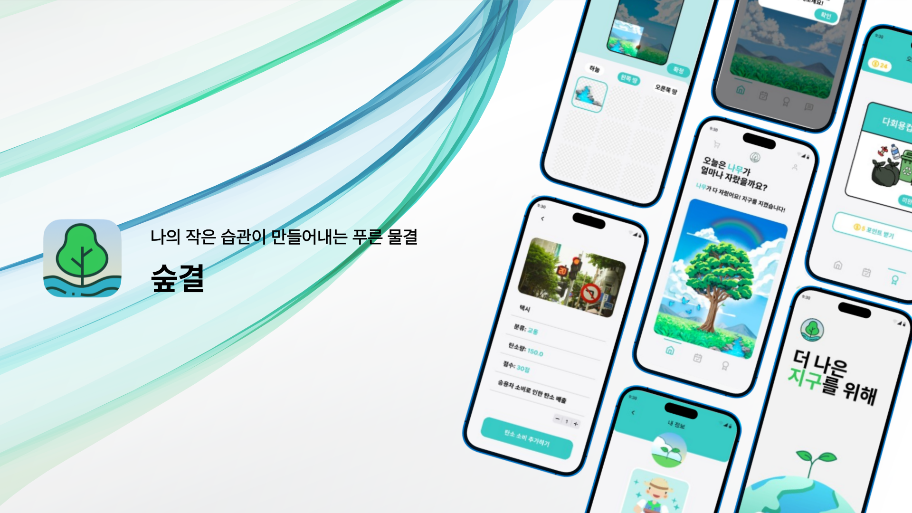

# 구름톤 서북지구 팀 프로젝트 : 숲결 🌿

## 앱 소개

: AI를 기반으로 일상 속에서 탄소 소비를 기록하고, 시각화 하는 친환경 습관 형성 app
  

## 👨‍👨‍👧 B4AFTER 팀 소개

|                                                               BE                                                                |                                       BE                                        |                                        BE                                         |                                       BE                                        |                                       FE                                        |                                                             
|:-------------------------------------------------------------------------------------------------------------------------------:|:-------------------------------------------------------------------------------:|:---------------------------------------------------------------------------------:|:-------------------------------------------------------------------------------:|:-------------------------------------------------------------------------------:|
|  |    |    |  |  |  
|                                                               윤민섭                                                               |                                       김혜림                                       |                                        박채연                                        |                                       박세웅                                       |                                       김민주                                       | 
|                                             [Minsub](https://github.com/minsubyun1)                                             |                  [kimhyerim01](https://github.com/kimhyerim01)                  |                  [yeonchaepark](https://github.com/yeonchaepark)                  |                    [hardwoong](https://github.com/hardwoong)                    |                   [calla1102](https://github.com/calla1102)                   | 
